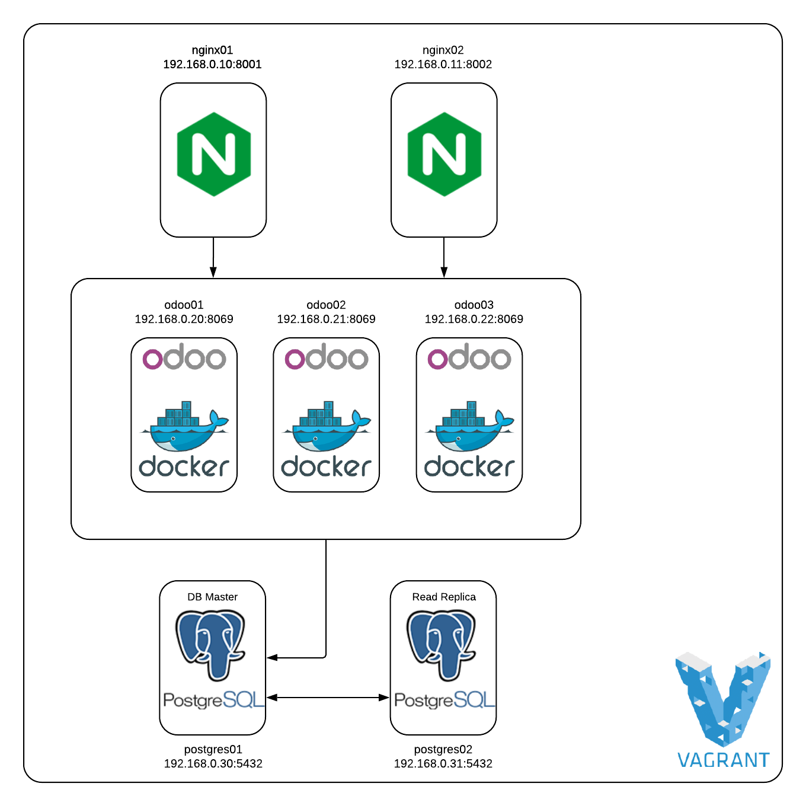

# Devops Test Case


## Infra Diagram




## Vagrant Box Setup
All boxes are running CentOS 7.

## Odoo
Application servers are running Odoo 12.

## Data Base
Data base version selected was postgresql-10.

## Store session
I used the ```base_session_store_psql``` to store the sessions on Postgresql.

addon: [base_session_store_psql](https://apps.odoo.com/apps/modules/12.0/base_session_store_psql)

## Monitoring
I created a small python script to check the servers using the nagios plugins and nrpe service.

[monitoring.py](monitoring.py)